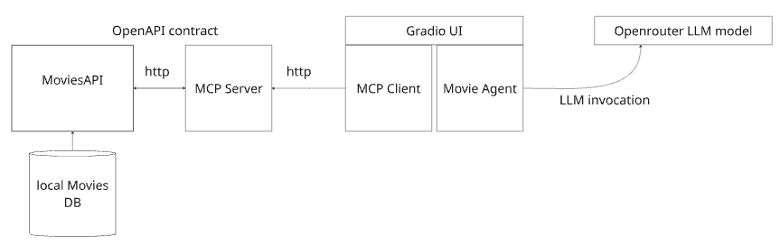
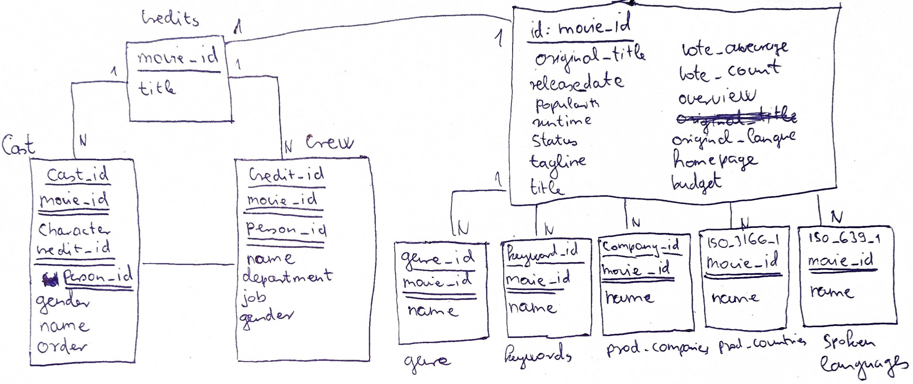

# MoviesMCP
Demo repository for Movies DB interaction using MCP server. This project demonstrates how to build a simple Movies API using <b>FastAPI</b>, and then create an MCP server and client to interact with the API. The Movies API allows users to search for movies based on various criteria such as actor, director, genre, release year, and more. The MCP server acts as an intermediary between the client and the Movies API, processing user queries and fetching relevant data from the API.
The backend database is a in memory <b>DuckDB</b> instance that is populated with movies and credits data from the movie dataset.<br>
The project also includes data ingestion scripts to populate the database, as well as smoke tests for the API endpoints.
The MCP client is built using <b>Strands agent</b> that can interact with the MCP server to fetch movies data based on user queries. The client provides a simple <b>Gradio interface for users </b> to ask questions about movies and receive relevant results from the Movies API.

### Project structure

```
MoviesMCP/
├── data/
│   ├── movies.duckdb
│   ├── tmdb_5000_credits.csv
│   └── tmdb_5000_movies.csv
├── misc/
│   └── ER_movies.png
├── src/
│   ├── __init__.py
│   ├── movies_api.py
│   ├── movies_mcp_client.py
│   ├── movies_mcp_server.py
│   ├── ingestion/
│   │   ├── ingest_credits.py
│   │   ├── ingest_movies.py
│   │   └── utils.py
│   ├── models/
│   │   └── movies_models.py
│   └── test/
│       ├── conftest.py
│       └── test_movies_api.py
├── pyproject.toml
├── requirements.txt
├── README.md
└── example_env
```
### install dependencies
```bash
pip install -r requirements.txt
```
You can create uv environment based on requirements.txt file and install dependencies in it.

```bash
uv add -r requirements.txt
uv sync
```

### Database tables - entitites

In accordance with the ER diagram, there are two main tables in the database: `movies` and `credits`. The `movies` table contains information about each movie, such as title, release date, rating, budget, vote_count etc. The <b>list attributes</b> like genres, production_companies, production_countries etc. are stored in separate table and are linked by a common key, `movie_id`,.
The `credits` table contains information about movie title and the `cast` and `crew` of each movie, including actors, directors, producers, and other crew members. The two tables are linked by a common key, `movie_id`, which allows us to join the tables and retrieve relevant information about movies and their credits.<br>
<br>Data ingestion script are available in `src/ingestion` folder. It can be used to populate onto in-memory, local SQL DuckDB database.
scripts are separately inggests Credits and Movies data. You need to run both scripts to populate the database with movies and credits data.

```bash
 uv run python src/ingestion/ingest_movies.py
 uv run python src/ingestion/ingest_credits.py
```

### Environment variables
you can create `.env` file in the root directory and add below environment variables to it. These variables are used to configure the database connection and other settings.
See: example_env file for reference.

### Running FastAPI server

```bash
uv run src/movies_api.py 
```
This will start the FastAPI server on `http://localhost:8080`. E.g. Obtaining movies by actor / director / any cast member (Speilberg) can be done by hitting below endpoint:
```
curl -X 'GET' \
  'http://127.0.0.1:8080/movies/search?actor=Spielberg&sort_by=popularity&sort_order=desc&limit=20&offset=0' \
  -H 'accept: application/json'
 ```
<br> You can access swagger documentation at `http://localhost:8080/docs` to interact with the API endpoints. For further details provided in OpenAPI specs.

### MCP Server
The MCP server is using the FastAPI server as a backend to fetch movies data based on user queries. It listens for incoming requests from the MCP client and processes them using the Movies API.
To start the MCP server, run the following command:
```
    uv run src/movies_mcp_server.py
```
### MCP Client
Launching client with the following command (<b>please make sure you have already started the Movies API and the MCP server</b>):
```
 uv run src/movies_mcp_client.py
```
This will launch an MCP client with Strands agent that can interact with the Movies API's MCP server to fetch movies data based on user queries. You can ask questions like "What are the top 5 most popular movies directed by Christopher Nolan?" or "List all movies starring Tom Hanks released after 2010." The client will use the MCP server to process these queries and return relevant results from the Movies API.
Example question:
<br><b>Can you show sci-fi movies that Leonardo Dicaprio is playing and produced before 2015?</b>

Response:<br>
`gpt-oss-120b:free:`<br>
Here’s the sci‑fi film that matches your criteria:

| Title | Release Year | Rating |
|-------|--------------|--------|
| **Inception** | 2010 | 8.1 |

Leonardo DiCaprio stars in *Inception*, a science‑fiction thriller directed by Christopher Nolan and released in 2010, which is before 2015. If you’d like more recommendations (e.g., other sci‑fi titles starring Leonardo DiCaprio, or similar movies), just let me know!<br><br>
`Mistral medium 3:`<br>
Here is a sci-fi movie starring Leonardo DiCaprio produced before 2015:

| Title | Release Year | Rating | Description |
|--------|---------------|--------|-------------|
| Inception | 2010 | 8.1 | Cobb, a skilled thief who commits corporate espionage by infiltrating the subconscious of his targets is offered a chance to regain his old life as payment for a task considered to be impossible: "inception", the implantation of another person's idea into a target's subconscious. |
<br><br>
<b>What are the top 5 most popular movies directed by Christopher Nolan?</b><br><br>
`gpt-oss-120b:free:`<br>
### Top 5 Most Popular Christopher Nolan Films  

| Rank | Title | Release Year | TMDB Popularity* | TMDB Rating |
|------|-------|--------------|------------------|-------------|
| 1 | **Interstellar** | 2014 | 724.25 | 8.1 |
| 2 | **The Dark Knight** | 2008 | 187.32 | 8.2 |
| 3 | **Inception** | 2010 | 167.58 | 8.1 |
| 4 | **Batman Begins** | 2005 | 115.04 | 7.5 |
| 5 | **The Dark Knight Rises** | 2012 | 112.31 | 7.6 |

\*Popularity is a TMDB metric that reflects how often a movie is searched for and viewed in the database; higher numbers mean more buzz.

These are the five Nolan‑directed movies with the greatest popularity scores in the database. Let me know if you’d like more details on any of them (e.g., plot summary, cast, or where to watch).
<br>
`Mistral medium 3:`<br>
Certainly! Here's a concise summary of the top 5 most popular movies directed by Christopher Nolan:

1. **The Dark Knight (2008)**
   - **Rating:** 8.2
   - **Genres:** Action, Crime, Drama, Thriller
   - **Description:** Batman, with the help of allies, faces the chaotic Joker in a battle for Gotham's soul.

2. **Inception (2010)**
   - **Rating:** 8.1
   - **Genres:** Action, Adventure, Mystery, Science Fiction, Thriller
   - **Description:** A thief extracts secrets through dream-sharing technology and is tasked with planting an idea.

3. **Interstellar (2014)**
   - **Rating:** 8.1
   - **Genres:** Adventure, Drama, Science Fiction
   - **Description:** Explorers travel through a wormhole in search of a new habitable planet for humanity.

4. **The Prestige (2006)**
   - **Rating:** 8.0
   - **Genres:** Drama, Mystery, Thriller
   - **Description:** Two magicians engage in a fierce rivalry with deadly consequences.

These films showcase Christopher Nolan's versatility and mastery in blending complex narratives with stunning visuals and deep emotional themes.
### Smoke tests
Generated Smoke tests for API calls are available under src/test folder.
```bash
python -m pytest src/test/test_movies_api.py
```
